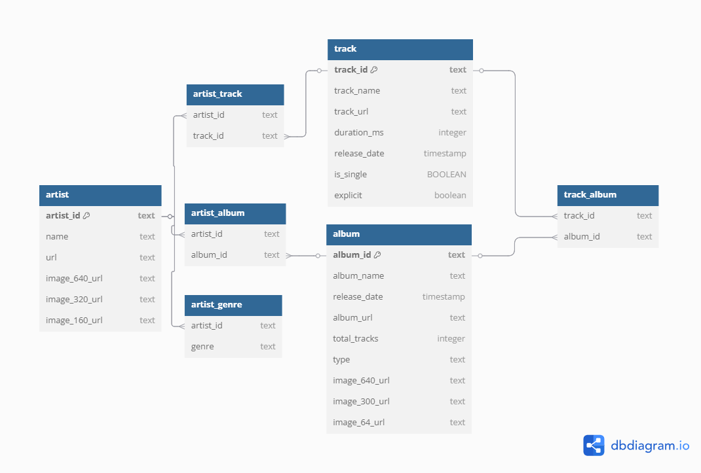

# Spotify Genre Pipeline
## Introduction
An ETL (Extract, Transform, Load) pipeline designed to search for tracks by genre on Spotify. It orchestrates data from Spotify API to local database through a series of scripts. It uses various Python libraries: *requests* for extracting data from api, *Pandas* for data manipulation and cleaning, *SQLAlchemy* to connect to database and load data.The pipeline performs the following tasks:  
1. **Extract**: Fetches data from the Spotify API, including tracks, albums, and artist details based on a specified genre.
2. **Transform**: Processes and structures the extracted data into a format suitable for loading into a database. This includes creating dataframes for tracks, albums, artists, and their relationships  
**Filter**: Filter out duplicate values in main tables: track, artist and album
3. **Load**: Insert the transformed data into PostgreSQL database

All of these will be automated by CRON task. 
## Project Components
### Structure
```
.
├── README.md
├── create_table.sql
├── cron.log
├── log
│   └── {today}.log
├── main.py
├── requirements.txt
├── setup.sh
└── utils
    ├── __init__.py
    ├── database
    │   ├── __init__.py
    │   └── db.py
    ├── logger
    │   └── __init__.py
    ├── pipeline
    │   ├── __init__.py
    │   ├── extract.py
    │   ├── load.py
    │   └── transform.py
    └── spotify
        ├── __init__.py
        └── authentication.py
```
`utils`: a collection of utility submodules that handle ETL pipeline aspects  
- `database`: Manage database connections and session using SQLAlchemy
- `logger`: Handles logging for the project
- `pipeline`: Contains the core ETL logic  
    - `extract`: Handles the extraction of data from Spotify API
    - `transform`: Processess and transforms the extracted data into suitable format for loading
    - `load`: Manages the loading of data into database
- `spotify`: Handle authentication with Spotify API

### Database Design

There are 2 types of tables:
1. Main tables: artist, track and album
2. Relational tables: artist_track, artist_album, artist_genre, track_album

## Step to run the project
1. Clone the project by using the following command:
```bash
git clone https://github.com/theo-thanhlam/spotify_etl.git
```
2. Run the setup script: 
```bash
cd spotify_etl
bash setup.sh
```
3. After running the script, you will see there is a new file `.env`. Assign your Spotify client id and secret (can be found [here](https://developer.spotify.com/documentation/web-api)) as well as your database URL
4. **IMPORTANT!!** Connect to your database terminal and run the `create_table.sql` script to create tables for the project
5. Now everything is ready, you can run the script by the command
```bash
source .venv/bin/activate #Activate virtual environment first
python3 main.py
```
6. (Optional) Automate this script by CRON tab. You need to edit filepath in `cronjob.sh` before running it. Open crontab editor by the command `crontab -e` and add new job
```bash
#Run this script every hour
* */1 * * * python3 main.py >> /path/to/cron-log/cron.log 2>&1
```
Now the pipeline is running in background. You can check pipeline log in `log/{today}.log` and cron log in `cron-log/cron.log`
## Result
These are example of pipeline log files and crontab log:   
[Log file example](/log/2025-02-19.log)  
[Crontab log example](/cron.log)

Here are examples from database tables

**Track**


**Artist**


**Album**


**Artist_track**


**Artist_album**


**Artist_genre**  


**Track_album**  

